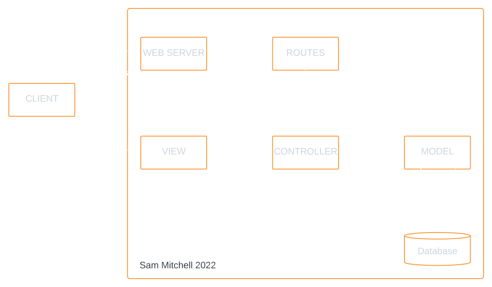
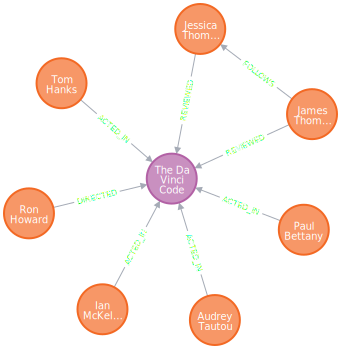
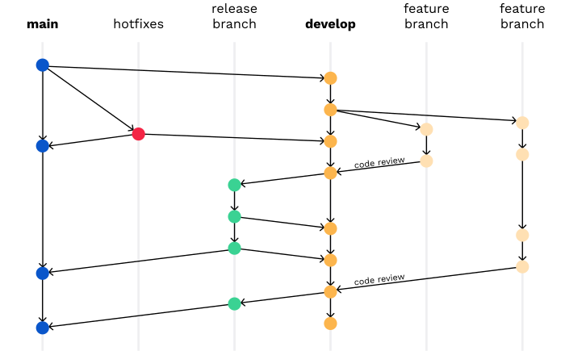
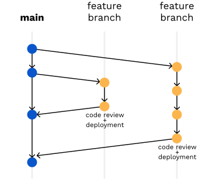
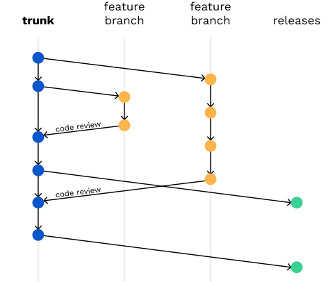
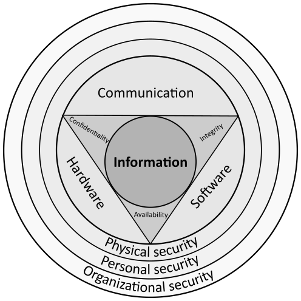
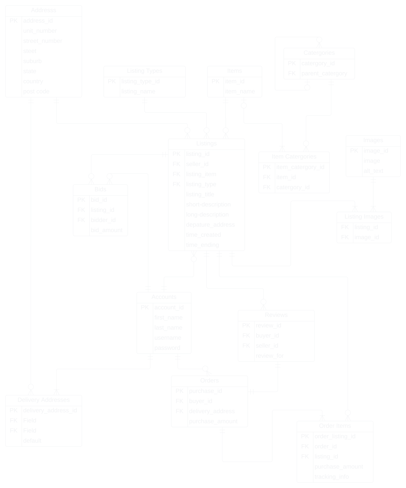

<!-- Styling required for conversion to PDF format when using no margins in print options, ensure print background option is enabled -->
<div style="padding: 2em">

T2A1 - Workbook

Sam Mitchell

---

<div style="page-break-after: always;"></div>

---

# Table of Contents

* [Table of Contents](#table-of-contents)
* [Ruby on Rails](#ruby-on-rails)
  * [Q1 - Describe the architecture of a typical Rails application](#q1---describe-the-architecture-of-a-typical-rails-application)
  * [Q2 - Identify a database management system (DBMS) commonly used in web applications (including Rails) and discuss the pros and cons of this database](#q2---identify-a-database-management-system-dbms-commonly-used-in-web-applications-including-rails-and-discuss-the-pros-and-cons-of-this-database)
* [Project Management](#project-management)
  * [Q3 - Discuss the implementation of Agile project management methodology](#q3---discuss-the-implementation-of-agile-project-management-methodology)
  * [Q4 Provide an overview and description of a standard source control workflow](#q4-provide-an-overview-and-description-of-a-standard-source-control-workflow)
  * [Q5 - Provide an overview and description of a standard software testing process (e.g. manual testing)](#q5---provide-an-overview-and-description-of-a-standard-software-testing-process-eg-manual-testing)
* [Security and Privacy](#security-and-privacy)
  * [Q6 - Discuss and analyse requirements related to information system security and how they relate to the project](#q6---discuss-and-analyse-requirements-related-to-information-system-security-and-how-they-relate-to-the-project)
  * [Q7 - Discuss common methods of protecting information and data and how you would apply them to the project](#q7---discuss-common-methods-of-protecting-information-and-data-and-how-you-would-apply-them-to-the-project)
  * [Q8 - Research what your legal obligations are in relation to handling user data and how they can be met for the project](#q8---research-what-your-legal-obligations-are-in-relation-to-handling-user-data-and-how-they-can-be-met-for-the-project)
* [Relational Databases](#relational-databases)
  * [Q9 - Describe the structural aspects of the relational database model. Your description should include information about the structure in which data is stored and how relations are represented in that structure](#q9---describe-the-structural-aspects-of-the-relational-database-model-your-description-should-include-information-about-the-structure-in-which-data-is-stored-and-how-relations-are-represented-in-that-structure)
  * [Q10 - Describe the integrity aspects of the relational database model. Your description should include information about the types of data integrity and how they can be enforced in a relational database.](#q10---describe-the-integrity-aspects-of-the-relational-database-model-your-description-should-include-information-about-the-types-of-data-integrity-and-how-they-can-be-enforced-in-a-relational-database)
  * [Q11 - Describe the manipulative aspects of the relational database model. Your description should include information about the ways in which data is manipulated (added, removed, changed, and retrieved) in a relational database](#q11---describe-the-manipulative-aspects-of-the-relational-database-model-your-description-should-include-information-about-the-ways-in-which-data-is-manipulated-added-removed-changed-and-retrieved-in-a-relational-database)
* [Marketplace Case Study - Ebay](#marketplace-case-study---ebay)
  * [Q12 - Conduct research into a marketplace website (app) and answer the following parts:](#q12---conduct-research-into-a-marketplace-website-app-and-answer-the-following-parts)

---

<div style="page-break-after: always;"></div>

---

# Ruby on Rails

---

<div style="page-break-after: always;"></div>

---

## Q1 - Describe the architecture of a typical Rails application



### MCV

The typical rails applications follows the 'Model-View-Controller' pattern which can be loosely defined as follows

* Model
  * The applications dynamic data structure
  * Responsible for data management
  * Receives user input through the controller
* View
  * Any information displayed
* Controller
  * Receives input from the user and passes commands to the view or model

In practice a Ruby Rails application has more components then just this.
The following is a breakdown of the major components in a Rails Application

<div style="page-break-after: always;"></div>

### Web Server

A rails application uses a 'Puma' web server by default.
Puma provides a simple, fast, multi-threaded HTTP Server for ruby applications

### Routes

The purpose of the Rails router is to interpret URLs and load the appropriate controller to process the HTTP request.
The router also manages the generation of paths and URLs so that these do not need to be hardcoded in views.
The /config/routes.rb file is used to define the both the controllers and actions for HTTP requests received from the server and the path/ URL generation methods.

### CONTROLLER

The controller is loaded by the router and the appropriate action or method is called. The most common actions follow the CRUD pattern using POST, GET, UPDATE, DELETE methods.
The controller acts as a middle man between the View and Model components.

### MODEL

The model contains the 'Business Logic', or the code and logic that controls how data is manipulated and validated. It responds to CRUD actions called by the controller and returns information to the controller regarding the success of the operation and any data requested. It is the only component that directly interacts with the applications database.

### Database

In a rails environment, the default Database Management System is SQLITE3, which is a file based DBMS. This works well as a lightweight system for development and testing however is not appropriate for deployment.

### VIEW

In rails the 'View' component of the MVC pattern is managed by a combination of 'layouts', 'templates' and 'partials'.

<div style="page-break-after: always;"></div>

#### Partials

Partials are the smallest unit of a Rails View. They can be rendered by templates or layouts and are used to simplify larger renders by breaking them down into smaller re-usable units. Partials have access to the variables of the template that called them by also can be passed additional local parameters that allow further control to the partial, like hiding an option in a context menu if the partial was called by a specific template.

#### Templates

Templates render the information output from a controller action. Generally each of the different actions will have their own template used to render information or forms (#index, #show, #new, #update, #delete)
Templates use a combination of simple conditionals and loops to render the supplied data. This may be done with the ues of partials.

#### Layouts

Layouts are used to wrap the outputs from the various controller actions in a common HTML view template. The HTML and HEAD elements of the outputted web page are generally found in the layout. It might also include headers or footers.
While the template itself is rendered through a `<%= yield %>` block in the HTML body element, additional information can be passed to the layout by specifying `content_for`. For example:

```html
<!-- index.html.erb -->
<%= content_for :head do %>
<title>A page title</title>
<% end %>
<p>Page content</p>

<!-- layout.html.erb -->
<head>
  <%= yield :head %>
</head>
<body>
  <%= yield %>
</body>

<!-- output.html -->
<head>
  <title>A page title</title>
</head>
<body>
  <p>Page content</p>
</body>
```

---

<div style="page-break-after: always;"></div>

---

## Q2 - Identify a database management system (DBMS) commonly used in web applications (including Rails) and discuss the pros and cons of this database

### NEO4J

Neo4j is a DBMS built around a graph database. A graph database is one that uses a graph structure to store data. Data is stored in the form of either an 'node', 'edge' or 'property'. A Neo4j database can be accessed using 'Cypher' (an open-source query language developed by Neo4j) over HTTP or using the binary 'Bolt' protocol.
Both the DBMS and Cypher are considered mature systems and are widely used by developers. Cypher is used by other DBMS as their query language and Neo4j can be integrated with other services such as Google's Anthos.
A Neo4J database can be hosted locally or on the cloud using the AuraDB service provided by Neo4j.

#### Pros

* Good for unstructured data
* Faster when searching more than one level deep
* Useful UI tools for visualising query outputs and graph structures
* Cypher is widely used in other Graph Network DBMS
* Can select large amounts of data from multiple types of nodes in one query vs SQL requiring you to join the results of multiple queries
* Useful when the relationships between objects are just as important as the data the objects contain.

#### Cons

* Not as adept and performing the same operation on large numbers of data elements.
* Less efficient at simple tasks over simple structured data because the data structure of an object needs to be inspected to view its structure vs a traditional relational database where the structure of a table is known before an operation.
* Not automatically supported by Ruby on Rails (however there are gems available to extend Neo4j to Rails)
* The benefits gained in interpreting data are lost if a Graph Network Database is used to simply store data.


<div style="page-break-after: always;"></div>


#### Graph Databases

> 
>
> ##### Nodes
>
> Nodes represent an object in the database. In the example to the right  circles represent 'Person' nodes and  circles represent 'Movie' nodes.
>
> ##### Edges
>
> Edges represent the relationships between nodes. Edges are labelled with types, in the example the right these types are [DIRECTED, ACTED_IN, REVIEWED, FOLLOWS].
>
> ##### Properties
>
> Properties are optionally used to describe both nodes (objects) and edges (relationships). They are stored as a key: value pair.
> A `Person` node may contain properties such as `name`, `date_of_birth` or `gender`, a `Movie` node may contain properties such as `title` or `release_date`, a `REVIEWED` edge may contain properties for `rating` or `reviewed date`.

---

<div style="page-break-after: always;"></div>

---

# Project Management

---

<div style="page-break-after: always;"></div>

---

## Q3 - Discuss the implementation of Agile project management methodology

The implementation of the Agile methodology requires more then just putting in place frameworks and using the correct terminology. It requires a cultural shift.

### The Manifesto for Agile Software Development

The values and principles defined by the "Manifesto for Agile Software Development" are as follows

#### Agile Software Development Values

We are uncovering better ways of developing software by doing it and helping others do it.

Through this work we have come to value:

> * **Individual and interactions** _over_ processes and tools
> * **Working software** _over_ comprehensive documentation
> * **Customer collaboration** _over_ contract negotiation
> * **Responding to change** _over_ following a plan

"That is to say, while both sides have value and the items on the right should be considered, the authors of the manifesto chose to tip the balance in favour of the items on the left."

#### Agile Software Development Principles

The Manifesto for Agile Software Development is based on twelve principles

> 1. Customer satisfaction by early and continuous delivery of valuable software.
> 2. Welcome changing requirements, even in late development.
> 3. Deliver working software frequently (weeks rather than months)
> 4. Close, daily cooperation between business people and developers
> 5. Projects are built around motivated individuals, who should be trusted
> 6. Face-to-face conversation is the best form of communication (co-location)
> 7. Working software is the primary measure of progress
> 8. Sustainable development, able to maintain a constant pace
> 9. Continuous attention to technical excellence and good design
> 10. Simplicity (the art of maximizing the amount of work not done) is essential
> 11. Best architectures, requirements, and designs emerge from self-organizing teams
> 12. Regularly, the team reflects on how to become more effective, and adjusts accordingly

<div style="page-break-after: always;"></div>

### Implementation of Agile Values and Principles

#### People over processes

The Agile methodology values the team and it's members of planning processes or tools.
The developers' knowledge, experience, thought processes, and how an individual works with other individuals in the team is more important then any framework put in place to manage workflow. Without competent and motivated individuals working in a cohesive team, work output and quality will not be to the level it could be.
By engaging the team members in the planing process a manager can draw on technical expertise from senior developers, allow a junior developer not indoctrinated into one way of thinking to question the way things are done or draw on group knowledge to estimate durations for tasks.

#### Documentation "Just barely good enough"

A 1000 page manual on how to service a car is useless without the car. Just as complete documentation on a incomplete program is useless. This does not mean that a development team should forgo documenting their software but instead it should be "just barely good enough". Just good enough to describe use cases, model and methods. Just good enough to allow a new member to the team to understand the software.

#### Being adaptable

There's a saying in the Army that no plan survives contact with the enemy, but this doesn't mean you don't plan at all, it means you need to be prepared to make changes to your plan on the fly based of intelligence gathered.

Project management is the same. You can spend weeks planning an entire project from start to finish before a single line of code is written. Assigning individuals to teams, and teams to tasks. Detailing milestones and deadlines only for a pandemic to spread, causing lockdowns and requirements to work from home. Now not all that planning is wasted but a significant part of it will no longer be relevant or require adjusting.
This isn't to say that an adept project manager would not be able to handle this shift in circumstances but by planning in shorter cycles and changing circumstances and requirements being the normal means a team working under Agile methodology will be able to stop and change direction faster because they are carrying less administrative momentum.

#### Short Cycles

By working in an iterative process that ends with a working piece of software at the end of each cycle a team can maintain customer satisfaction by enabling them to see the development and growth of the software. It also enables the customer to provide feedback which can be fed backing into the planning cycle to prioritise work or change requirements.

---

<div style="page-break-after: always;"></div>

---

## Q4 Provide an overview and description of a standard source control workflow

One of the most widely used source control systems today is Git, which is a Distributed Revision Control System (DRCS). A DRCS allows multiple users to maintain a full working copy of the repository locally to work on and any changes can be disseminated to their peers to use in their own local repository.
There is no one 'standard' source or version control workflow because different workflows may be more appropriate for different sized projects or different software being used to manage the workflow. It's not a one size fits all situation. However, because there are only so many 'commands' or actions available there is a lot of common ground between major workflow models and a few best practices from years of experience.

### The Main Branch

Nearly all source control workflows utilise a main branch as part of their model however different models disagree as to whether or not work should be directly committed to it.

### Development Branch

Some workflows use a development branch, a branch which is used for the development of new features. When the code is ready to be deployed it will either be merged back into the master branch or into a release branch.

### Feature Branches

Most model recommend the use of a feature branch. This is a branch from the main or development branch of code used to work on new features. Once the feature is complete it is merged back into the originating branch. Feature branches should be short lived in order to make the merging back into their originating branches as simple as possible.

### Release Branch

Some workflows use a release branch to separate a version of software for production. In some cases however the main branch is used for deployment and tagged with a version.

<div style="page-break-after: always;"></div>

### Commits & pushes

All workflows involve the use of a local repository. Changes are made to this local repository. When enough changes have been made, files are committed together in logical groupings with informative messages about the changes made. In order for the changes to be shared they need to be 'pushed' to the master branch.

### Examples

| Flow Variants                                                                       | Trunk Based Development                                                                     |
| ----------------------------------------------------------------------------------- | ------------------------------------------------------------------------------------------- |
| The original 'Gitflow' (has fallen out of favour in recent years due to complexity) | TBD for small teams. (incomplete features are disabled for release through 'feature flags') |
|                                                       |                                                        |
| 'Github Flow'. Used by Github for a continuos development environment               | Scaled TBD (Useful for managing code review in larger teams)                                |
|                                                |                                                          |

---

<div style="page-break-after: always;"></div>

---

## Q5 - Provide an overview and description of a standard software testing process (e.g. manual testing)

### The Software Testing Life Cycle (STLC)

There are four stages to testing in the Software Testing Life Cycle. Unit Testing, Integration Testing, System Testing and Acceptance Testing. These can be further separated into two categories.
| Verification Stages | Validation Stages|
|-|-|
|Unit Testing| Acceptance Testing|
|System Testing| |
|Integration Testing | |

#### Unit Testing

In this stage individual components are tested. In OOP the units being tested may be a single class but may be individual functions if procedural programming is being used.
All units are tested to check functionality and this stage can occur as changes are made to code to ensure that any errors are caught early to reduce the debugging overhead later in the development process.
Testers require a detailed understanding of functions and classes to carry out this stage of testing. This type of testing is called 'White Box Testing'.

#### Integration Testing

In this stage of testing, individual components are tested again individually and then tested together as a group. The aim of this stage is to assess how well all the components work together and identify any issues in the behaviours of interacting components.
Groups of working components should be combined into progressively larger groups until the entire system is being tested.

#### System Testing

System Testing is hte final stage in the verification stage of testing. The aim of this stage is to verify the system meets all requirements and specifications.

<div style="page-break-after: always;"></div>

#### Acceptance Testing

Acceptance Testing is carried out in the final stages before the release of a system. It may include:

* End user testing
* Contractual acceptance testing
* Alpha and Beta testing

This stage of testing is often carried out using 'Black Box Testing', which is where the tester has no knowledge of the inner workings of the system.

### STLC and agile

In agile the STLC is broken down into 6 steps.

1. **Requirement Analysis**
Understand the specifications for the system, what are the expected outputs, what are the priorities?
2. **Test Planning**
Prepare documentation, carry out time analysis and assign tasks to teams.
3. **Test Case Design and Development**
Create test cases and prepare scripts for the automation of testing.
4. **Test Environment Setup**
Understand minimum system requirements. Setup and smoke test the testing environments ( Smoke testing is a type of testing designed to find basic and critical bugs. The term originates from an older hardware test where the device passed the test if it didn't catch fire when turned on.)
5. **Test Execution**
Run test cases, identify and log failures with details, create bug fixes and test again
6. **Test Closure**
Verify that all tests are completed, document the testing results and prepare the test closure report.

---

<div style="page-break-after: always;"></div>

---

# Security and Privacy



---
<div style="page-break-after: always;"></div>
---

## Q6 - Discuss and analyse requirements related to information system security and how they relate to the project

### People

The human factor must not ignored when looking at cyber security. In addition to the vetting of staff when allowing access to data, those with access must be aware of cyber security risks such as phishing/ spear-phishing attacks, physical attacks using malicious hardware (see [USB](https://www.tripwire.com/state-of-security/security-data-protection/malicious-usb-drives-are-being-posted-to-businesses/) [attacks](https://en.wikipedia.org/wiki/Stuxnet#Windows_infection))
Clearly defined processes and regular training are important and useful tools in managing the human factor of cyber security.


### Processes

Procedural controls for managing cyber security must be robust and comprehensive. Things that fall into this area include:
How do you manage a remote worker connecting from an external network?
Do you allow workers to connect their own USB devices to the network?
What individuals and what roles can access specific data?
What are the procedures in the instance of a data breach?

<div style="page-break-after: always;"></div>

### Technology

#### The CIA Triad

When it comes to information system security there are three things that need be balanced

* ##### Confidentiality

Only those who are authorised have access to specific assets and those who are not authorised are actively denied access to those assets.

For this project this means protecting sensitive personal information of users. Primarily this can be done by restricting access to this information however this information can also be encrypted for extra protection.
Financial information can be protected by using trusted third party systems to process payments, eg paypal.

* ##### Integrity

Ensuring data is correct and authentic. Verifying it has not been modified.
(This is different from data integrity in a DBMS)

In regards to a marketplace application the primary concern here is the interception of information while a transaction is being executed that may allow the modification of transaction price, allowing a buyer to make a purchase for less then the actual amount, or receiving an item of greater value instead of the purchased item.
This type of activity can be stopped by using authentication tokens in forms and minimising the amount of information transferred in POST methods. All information coming from the client should be cross-checked against server side records.

* ##### Accessibility

Networks, systems, and applications must be running and able to be connected to to allow authorised users to have timely and reliable access to resources when they are needed.

For a marketplace application, quick reactions from the application are paramount in enhancing the user experience. This means data that is not of a sensitive nature should be stored in a manner that is easy and quick for the server to send the client for display. Only what is necessary to be protected should be locked away behind slower decryption processes.

---

<div style="page-break-after: always;"></div>

---

## Q7 - Discuss common methods of protecting information and data and how you would apply them to the project

* Restrict physical access to servers - handled entirely by existing ACME Corporation procedures.
* VPNs should be used for system access for remote developer access.
* Backup data to external storage to protect against ransomware attacks.
* User authentication should ideally include two-factor authentication to reduce the risk of data loss in the case of data spill of passwords.
* Data 'At-rest' - The default state for data being stored should be protected.
  * Encryption
  * Tokenisation (The process of substituting sensitive data with data that has no meaning)
* Data 'In-transit'
  * Encryption or Tokenisation should be used to protect live data.
  * The use of third party agents like paypal to handle payment information     means that this system wont have to do it.
* Good development practices - avoiding vulnerabilities such as SQL injections
* Only store the minimum amount of data about a user as possible

* Roles and privileges management
  * Only allow the minimum amount of users to have access to stored data and processes. This should ideally be senior members of the company.
  * Role segregation - Developers should have little to no access to stored data once it has been deployed.

* Third party audits of all software and cyber security practices

---

<div style="page-break-after: always;"></div>

---

## Q8 - Research what your legal obligations are in relation to handling user data and how they can be met for the project

### Australian Laws

#### The Privacy Act 1998

The Privacy Act 1998 contains legislation for the handling of user data in Australia.

[The Privacy Act 1998, Part II, Div 1, Section 6C](https://www.legislation.gov.au/Details/C2022C00135/Html/Text#_Toc85712337) describes the definition of an 'Organisation' that this act applies to. 
Subsection (1) excludes small business owners from this definition.

[The Privacy Act 1998, Part II, Div 1, Section 6D](https://www.legislation.gov.au/Details/C2022C00135/Html/Text#_Toc85712338) describes the definition of a small business.
> What is a small business?
>(1)  A business is a small business at a time (the test time) in a financial year (the current year) if its annual turnover for the previous financial year is $3,000,000 or less.
>
>Test for new business
>
>(2)  However, if there was no time in the previous financial year when the business was carried on, the business is a small business at the test time only if its annual turnover for the current year is $3,000,000 or less.

Subsection (4) lists exclusions from the definitions in Subsections (1), (2)
Subsections (5),(6),(7),(8),(9) provide exceptions from the exclusions listed in subsection (4)

#### The Australian Privacy Principles

[The Privacy Act 1998, Schedule 1](https://www.legislation.gov.au/Details/C2022C00135/Html/Text#_Toc85712716) sets out the 13 Australian Privacy Principles (APP).
These principles are separated into 5 sections

* [Part 1 - Consideration of personal information privacy](https://www.legislation.gov.au/Details/C2022C00135/Html/Text#_Toc85712718)
* [Part 2 - Collection of personal information](https://www.legislation.gov.au/Details/C2022C00135/Html/Text#_Toc85712721)
* [Part 3 - Dealing with personal information](https://www.legislation.gov.au/Details/C2022C00135/Html/Text#_Toc85712725)
* [Part 4 - Integrity of Personal Information](https://www.legislation.gov.au/Details/C2022C00135/Html/Text#_Toc85712730)
* [Part 5 - Access to, and correction of personal information](https://www.legislation.gov.au/Details/C2022C00135/Html/Text#_Toc85712733)

<div style="page-break-after: always;"></div>

#### The Online Safety Act 2021

If this project affords users the ability to make comments about a person or upload media files then the project may also have to comply with [The Online Safety Act 2021](https://www.legislation.gov.au/Details/C2022C00052)

The Online Safety Act 2021 deals with cyber-bulling, cyber-abuse and the non-consensual sharing of intimate images.

### Standards

#### ISO/IEC 27000 Series

The ISO/IEC 27000 Series of standards describe best practices of the management of Information System Security.
In particular the ISO 27001, Annex A describes 114 controls grouped into 14 categories:

This document only briefly describes the 114 controls however ISO 270002 goes into further details on these controls.
_(Both of these documents const in excess of $150AUD each to purchase and I was unable to find free versions of these documents so I'm not currently able to go into more detail)_

### Compliance

Even if this project does not full under The Privacy Act 1998 at its launch, we should plan for it to eventually grow to the size that it will. This means complying with the above Government legislation and recognised international standards as best is as possible from the outset.

There is a considerable amount of information contained in these documents and the development team should either be granted access to a company Privacy Officer from the ACME Corporation if any have been appointed. Otherwise one senior member of the project team should be nominated as the 'Privacy Subject Matter Expert' (SME).

All members of the development team will have an understanding of the Australian Privacy Principles however the Privacy Officer or SME will be expected to have a deeper knowledge and enable to team to comply with all regulations.

[An information pack](https://education.oaic.gov.au/privacy-officer-toolkit/) designed for government agencies' Privacy Officers is available however it contains a lot of useful information if a project Privacy SME is appointed.

---

<div style="page-break-after: always;"></div>

---

# Relational Databases

## Q9 - Describe the structural aspects of the relational database model. Your description should include information about the structure in which data is stored and how relations are represented in that structure

### Tables

Groups of related data are grouped together in tables. Tables can have many columns and many rows.

### Columns

Columns are used to define a piece of data stored in a row.
Columns can have additional properties assigned to them such as data types, whether or not they are mandatory or optional, size constraints and the ability to make them auto-increment.

### Rows

Rows store collections of data relating to a single event or entity.
Rows can be identified by the use of a Primary Key and and row can be stored across multiple tables with the inclusion of a Foreign Key (Primary Key from another row)

### Relationships

Relationships between objects are represented with the inclusion of a foreign key.

---

<div style="page-break-after: always;"></div>

---

## Q10 - Describe the integrity aspects of the relational database model. Your description should include information about the types of data integrity and how they can be enforced in a relational database.

### Constraints

Constraints are used to enforce data integrity by making sure all data fields are the same. Example constraints might be `NOT_NULL` or `UNIQUE`. The use of strict data types also helps with data integrity.

### ACID

To ensure data integrity all transactions in a relational database must be ACID transactions.

#### Atomicity

A transaction may be comprised of multiple statements, Atomicity guarantees that all statements in a transaction must pass for any of them to be applied. One example is the transfer of money from one bank account to another. A bank will not deposit money into account 'B' if it cannot be withdrawn from account 'A' and vice versa. In this case the transaction being the transfer is Atomic. 

#### Consistency (Correctness)

Consistency guarantees that a database will not be placed into an invalid state and will avoid corruption by illegal transaction. It involves ensuring all data written to the database is valid by all constraints

#### Isolation

Isolation guarantees that a database will be in the same state after multiple transactions are carried out concurrently as if they were all carried out sequentially.

#### Durability

Durability guarantees that transactions committed to a database will remain committed even in the case of a system failure. This involves storing completed transactions in non-volitional memory (essentially anything other then RAM in a modern system)

---

<div style="page-break-after: always;"></div>

---

## Q11 - Describe the manipulative aspects of the relational database model. Your description should include information about the ways in which data is manipulated (added, removed, changed, and retrieved) in a relational database

### CRUD

The 4 basic operations that can be carried out in a relational database follow the CRUD pattern.

* Create
* Read
* Update
* Delete

The most important part of implementing all of these operations (except Create) is the selection of the data upon which the operation is performed on.

### Relational Algebra

Most relational DBMS rely on relational algebra as the foundation (query language like SQL especially).
Relational algebra takes multiple inputs in the form of data relations and output a singular data relation.
Relational algebra draws some of its operators from set theory (union, intersection, difference and cartesian product) but with extra constraints. In addition to these operations, relational algebra also includes the Projection (select only certain attributes), Selection (SQL SELECT Query), Rename and Join operations.

---

<div style="page-break-after: always;"></div>

---

# Marketplace Case Study - Ebay

## Q12 - Conduct research into a marketplace website (app) and answer the following parts:

### a. List and describe the software used by the app.

Ebay currently use a wide variety of in house open source software for almost all of their operations. Their account on github.com has over 160 repositories.
The website itself runs on JavaScript (MarkoJS), CSS and HTML.
Oracle, MongoDB and its in house NuGraph built on the open source JanusGraph are used as DBMS.

### b. Describe the hardware used to host the app.

Ebay uses in house designed servers to distribute 500PT of storage and process 300 billion queries every day.
Each pf Ebay's search servers are comprised of 2 Intel 6138 processors, each with 64GB of RAM. Each server has multiple 2TB hardrives in RAID 10 and is capable of storing the database index.
Each server is connected to Ebay's network infrastructure via 2 x 10GBps network ports.
Each server fits into a 1U space in a standard 19" rack.
It is not specified how many server nodes Ebay uses however their system is designed to be able to add or remove server nodes as need to the number is probably always growing however given a standard 19" rack has 48U of space and Ebay is likely to have multiple of these in each server cluster and server clusters distributed all over the US and globe it is possible to imagine just how many of these server nodes there are.
This is just the storage server, in addition Ebay would require web servers and data servers for their operations.

### c. Describe the interaction of technologies within the app

Ebay uses a fairly standard front end stack of HTML, CSS and JavaScript in the form of MarkoJS, behind the scenes ebay utilises a a number of different technologies for their operations. They use a combination of traditional Relational Databases, Graph Network Databases and image databases. These are combined with powerful Machine Learning algorithms to provide users recommendations, enable fraud control and the ability to search for listings based on an image from their device.

<div style="page-break-after: always;"></div>

### d. Describe the way data is structured within the app

Ebay uses multiple data structures depending on what the data is used for.

#### Relational Databases

Used to store hashed indexes to enable faster lookups in the Graph Network
Used to store customer/ seller coupons

#### Graph Network Databases

Used to store the bulk of information regarding customers, listings and sales.
Enables Machine Learning algorithms to group records more easily.

#### Document Databases

Ebay uses dedicated databases to store images

### e. Identify entities which must be tracked by the app

|          |             |        |          |
| -------- | ----------- | ------ | -------- |
| Account  | Item        | Images | Category |
| Address  | Price       | Bids   | Review   |
| Listings | Transaction |        |          |

<div style="page-break-after: always;"></div>

### f. Identify the relationships and associations between the entities you have identified in part (e)

#### Accounts

Can have listings
Can have addresses (delivery address or item location)
Can a list of transactions (buy or sell)
Can have reviews (buyer or seller)

#### Listings

Must have a seller
Must be a type of item
Must have images
Can have a buy price
Can have bids
Can be reviewed

#### Items

Must belong to at least one category

#### Categories

Can have parent or children categories
Can have items associated

#### Transaction

Must have a listing
Must have a buyer
Must have a price
Must have a delivery address

#### Bids

Must belong to a listing
Must belong to a buyer
Must have a price

#### Review

Can be about a buyer, seller, or listing
Can be from a buyer or seller

<div style="page-break-after: always;"></div>

### g. Design a schema using an Entity Relationship Diagram (ERD) appropriate for the database of this website (assuming a relational database model)



<!-- Last page break to ensure background colour goes to the end of the printed page. In print settings do not print last page. -->
<div style="page-break-after: always;"></div>

</div>
