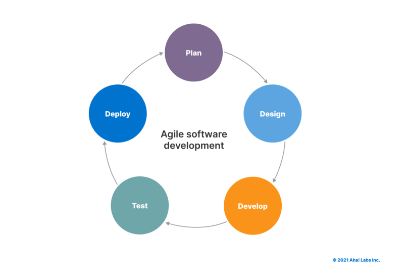
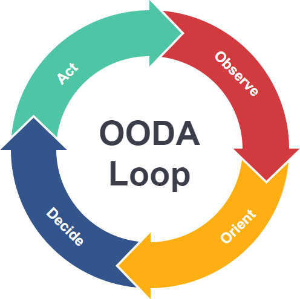

# T2A1 - Workbook

## Sam Mitchell

---- 

<div style="page-break-after: always;"></div>

<!-- vscode-markdown-toc -->
* 1. [Q1 - Describe the architecture of a typical Rails application](#Q1)
	* 1.1. [MCV](#MCV)
	* 1.2. [Web Server](#WebServer)
	* 1.3. [Routes](#Routes)
	* 1.4. [CONTROLLER](#CONTROLLER)
	* 1.5. [MODEL](#MODEL)
	* 1.6. [Database](#Database)
	* 1.7. [VIEW](#VIEW)
		* 1.7.1. [Partials](#Partials)
		* 1.7.2. [Templates](#Templates)
		* 1.7.3. [Layouts](#Layouts)
* 2. [Q2 - Identify a DBMS commonly used in web applications discuss the pros and cons of this database](#Q2)
	* 2.1. [NEO4J](#NEO4J)
		* 2.1.1. [Pros](#Pros)

<!-- vscode-markdown-toc-config
	numbering=true
	autoSave=true
	/vscode-markdown-toc-config -->
<!-- /vscode-markdown-toc -->

----
<div style="page-break-after: always;"></div>

##  1. <a name='Q1'></a>Q1 - Describe the architecture of a typical Rails application


###  1.1. <a name='MCV'></a>MCV

The typical rails applications follows the 'Model-View-Controller' pattern which can be loosely defined as follows

- Model
  - The applications dynamic data structure
  - Responsible for data management
  - Receives user input through the controller
- View
  - Any information displayed
- Controller
  - Receives input from the user and passes commands to the view or model

In practice a Ruby Rails application has more components then just this.
The following is a breakdown of the major components in a Rails Application

###  1.2. <a name='WebServer'></a>Web Server
  
A rails application uses a 'Puma' web server by default.
Puma provides a simple, fast, multi-threaded HTTP Server for ruby applications

###  1.3. <a name='Routes'></a>Routes

The purpose of the Rails router is to interpret URLs and load the appropriate controller to process the HTTP request.
The router also manages the generation of paths and URLs so that these do not need to be hardcoded in views.
The /config/routes.rb file is used to define the both the controllers and actions for HTTP requests received from the server and the path/ URL generation methods.

###  1.4. <a name='CONTROLLER'></a>CONTROLLER

The controller is loaded by the router and the appropriate action or method is called. The most common actions follow the CRUD pattern using POST, GET, UPDATE, DELETE methods.
The controller acts as a middle man between the View and Model components.

###  1.5. <a name='MODEL'></a>MODEL

The model contains the 'Business Logic', or the code and logic that controls how data is manipulated and validated. It responds to CRUD actions called by the controller and returns information to the controller regarding the success of the operation and any data requested. It is the only component that directly interacts with the applications database.

###  1.6. <a name='Database'></a>Database

In a rails environment, the default Database Management System is SQLITE3, which is a file based DBMS. This works well as a lightweight system for development and testing however is not appropriate for deployment.

###  1.7. <a name='VIEW'></a>VIEW

In rails the 'View' component of the MVC pattern is managed by a combination of 'layouts', 'templates' and 'partials'.

####  1.7.1. <a name='Partials'></a>Partials

Partials are the smallest unit of a Rails View. They can be rendered by templates or layouts and are used to simplify larger renders by breaking them down into smaller re-usable units. Partials have access to the variables of the template that called them by also can be passed additional local parameters that allow further control to the partial, like hiding an option in a context menu if the partial was called by a specific template.

####  1.7.2. <a name='Templates'></a>Templates

Templates render the information output from a controller action. Generally each of the different actions will have their own template used to render information or forms (#index, #show, #new, #update, #delete)
Templates use a combination of simple conditionals and loops to render the supplied data. This may be done with the ues of partials.

####  1.7.3. <a name='Layouts'></a>Layouts

Layouts are used to wrap the outputs from the various controller actions in a common HTML view template. The HTML and HEAD elements of the outputted web page are generally found in the layout. It might also include headers or footers.
While the template itself is rendered through a `<%= yield %>` block in the HTML body element, additional information can be passed to the layout by specifying `content_for`. For example:  

```html
<!-- index.html.erb -->
<%= content_for :head do %>
  <title>A page title</title>
<% end %>
<p>Page content</p>

<!-- layout.html.erb -->
<head>
  <%= yield :head %>
</head>
<body>
  <%= yield %>
</body>

<!-- output.html -->
<head>
  <title>A page title</title>
</head>
<body>
  <p>Page content</p>
</body>
```

----

<div style="page-break-after: always;"></div>

##  2. <a name='Q2'></a>Q2 - Identify a database management system (DBMS) commonly used in web applications (including Rails) and discuss the pros and cons of this database

###  2.1. <a name='NEO4J'></a>NEO4J

Neo4j is a DBMS built around a graph database. A graph database is one that uses a graph structure to store data. Data is stored in the form of either an 'node', 'edge' or 'property'. A Neo4j database can be accessed using 'Cypher' (an open-source query language developed by Neo4j) over HTTP or using the binary 'Bolt' protocol.
Both the DBMS and Cypher are considered mature systems and are widely used by developers. Cypher is used by other DBMS as their query language and Neo4j can be integrated with other services such as Google's Anthos.
A Neo4J database can be hosted locally or on the cloud using the AuraDB service provided by Neo4j.

####  2.1.1. <a name='Pros'></a>Pros

* Good for unstructured data
* Faster when searching more than one level deep
* Useful UI tools for visualising query outputs and graph structures
* Cypher is widely used in other Graph Network DBMS
* Can select large amounts of data from multiple types of nodes in one query vs SQL requiring you to join the results of multiple queries
* Useful when the relationships between objects are just as important as the data the objects contain.

#### Cons

* Not automatically supported by Ruby on Rails (however there are gems available to extend Neo4j to Rails)
* Not as adept and performing the same operation on large numbers of data elements.
* Less efficient at simple tasks over simple structured data because the data structure of an object needs to be inspected to view its structure vs a traditional relational database where the structure of a table is known before an operation.
* The benefits gained in interpreting data are lost if a Graph Network Database is used to simply store data.


> ----
>
> #### Graph Databases
>
> 
>
> ##### Nodes
>
> Nodes represent an object in the database. In the example to the right  circles represent 'Person' nodes and  circles represent 'Movie' nodes.
>
> ##### Edges
>
> Edges represent the relationships between nodes. Edges are labeled with types, in the example the right these types are [DIRECTED, ACTED_IN, REVIEWED, FOLLOWS].
>
> ##### Properties
>
> Properties are optionally used to describe both nodes (objects) and edges (relationships). They are stored as a key: value pair.
> A `Person` node may contain properties such as `name`, `date_of_birth` or `gender`, a `Movie` node may contain properties such as `title` or `release_date`, a `REVIEWED` edge may contain properties for `rating` or `reviewed date`.
> >
> ----

----

## Q3 - Discuss the implementation of Agile project management methodology

The implementation of the Agile methodology requires more then just putting in place frameworks and using the correct terminology. It requires a cultural shift.

### The Manifesto for Agile Software Development

The values and principles defined by the "Manifesto for Agile Software Development" are as follows

#### Agile Software Development Values

>----
>
>We are uncovering better ways of developing software by doing it and helping others do it.
>
> Through this work we have come to value:
>
> * **Individual and interactions** _over_ processes and tools
> * **Working software** _over_ comprehensive documentation
> * **Customer collaboration** _over_ contract negotiation
> * **Responding to change** _over_ following a plan
>
> "That is to say, while both sides have value and the items on the right should be considered, the authors of the manifesto chose to tip the balance in favor of the items on the left."
>
> ----


#### Agile Software Development Principles

>----
>
> The Manifesto for Agile Software Development is based on twelve principles
> 
> 1. Customer satisfaction by early and continuous delivery of valuable software.
> 2. Welcome changing requirements, even in late development.
> 3. Deliver working software frequently (weeks rather than months)
> 4. Close, daily cooperation between business people and developers
> 5. Projects are built around motivated individuals, who should be trusted
> 6. Face-to-face conversation is the best form of communication (co-location)
> 7. Working software is the primary measure of progress
> 8. Sustainable development, able to maintain a constant pace
> 9. Continuous attention to technical excellence and good design
> 10. Simplicity (the art of maximizing the amount of work not done) is essential
> 11. Best architectures, requirements, and designs emerge from self-organizing teams
> 12. Regularly, the team reflects on how to become more effective, and adjusts accordingly
>
> ----

### Implementation of Agile Values and Principles

#### People over processes

The Agile methodology values the team and it's members of planning processes or tools.
The developers' knowledge, experience, thought processes, and how an individual works with other individuals in the team is more important then any framework put in place to manage workflow. Without competent and motivated individuals working in a cohesive team, work output and quality will not be to the level it could be.
By engaging the team members in the planing process a manager can draw on technical expertise from senior developers, allow a junior developer not indoctrinated into one way of thinking to question the way things are done or draw on group knowledge to estimate durations for tasks. 

#### Documentation "Just barely good enough"

A 1000 page manual on how to service a car is useless without the car. Just as complete documentation on a incomplete program is useless. This does not mean that a development team should forgo documenting their software but instead it should be "just barely good enough". Just good enough to describe use cases, model and methods. Just good enough to allow a new member to the team to understand the software.

#### Being adaptable 
<!--   -->

There's a saying in the Army that no plan survives contact with the enemy, but this doesn't mean you don't plan at all, it means you need to be prepared to make changes to your plan on the fly based of intelligence gathered.

Project management is the same. You can spend weeks planning an entire project from start to finish before a single line of code is written. Assigning individuals to teams, and teams to tasks. Detailing milestones and deadlines only for a pandemic to spread, causing lockdowns and requirements to work from home. Now not all that planning is wasted but a significant part of it will no longer be relevant or require adjusting.
This isn't to say that an adept project manager would not be able to handle this shift in circumstances but by planning in shorter cycles and changing circumstances and requirements being the normal means a team working under Agile methodology will be able to stop and change direction faster because they are carrying less administrative momentum.

#### Short Cycles

By working in an iterative process that ends with a working piece of software at the end of each cycle a team can maintain customer satisfaction by enabling them to see the development and growth of the software. It also enables the customer to provide feedback which can be fed backing into the planning cycle to prioritise work or change requirements.

## Q4 Provide an overview and description of a standard source control workflow